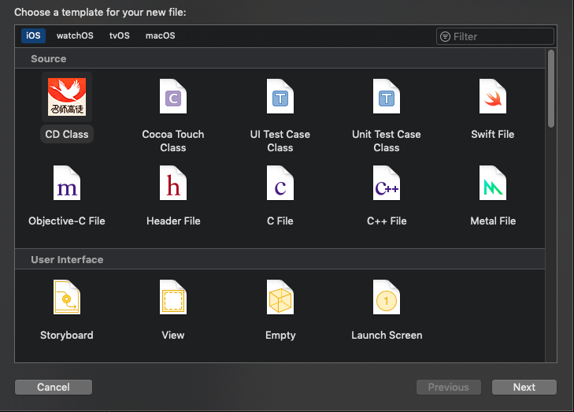

当我们在 Xcode 里新建文件时，Xcode 默认提供了多种文件模板，并且不同的 class，模板里默认提供的内容也不一样。


## 使用方式
进入 Xcode 模板存放路径：
```
cd /Applications/Xcode.app/Contents/Developer/Platforms/iPhoneOS.platform/Developer/Library/Xcode/Templates/File\ Templates/Source
```

将项目拉取下来，并命名为 `CD Class.xctemplate`（文件夹名自由定义，后缀名不可变），注意这个目录是系统目录，需要 root 权限才能修改，所以所有 git 命令都需要加 `sudo`。
```bash
sudo git clone https://github.com/cqzhong/JM_Xcode_Templates.git JM\ Class.xctemplate
```

无需重启 Xcode，直接新建文件，即可看到“JM Class”的模板可供选择。


